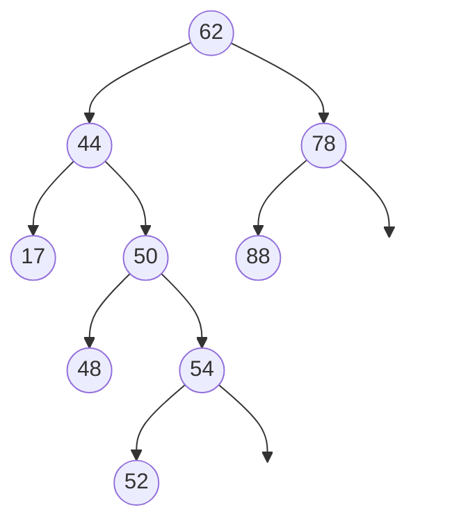
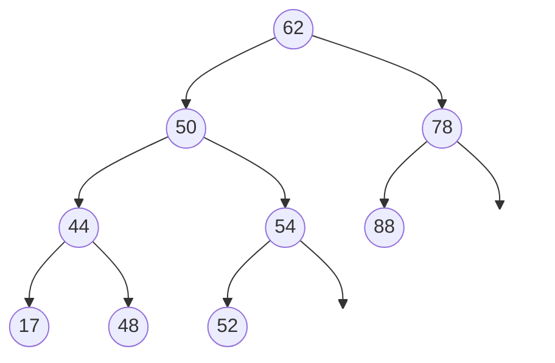

# Assignment 4

## Heaps

### R-8.6:

Show the output from the following sequence of priority queue ADT operations. The entries are key-element pairs, where sorting is based on the key value:

**Answer:**

1. After insert(5,a): [(5,a)]
2. After insert(4,b): [(4,b), (5,a)]
3. After insert(7,i): [(4,b), (5,a), (7,i)]
4. After insert(1,d): [(1,d), (4,b), (7,i), (5,a)]
5. After removeMin(): [(4,b), (5,a), (7,i)]
6. After insert(3,j): [(3,j), (4,b), (7,i), (5,a)]
7. After insert(6,c): [(3,j), (4,b), (7,i), (5,a), (6,c)]
8. After removeMin(): [(4,b), (5,a), (7,i), (6,c)]
9. After removeMin(): [(5,a), (6,c), (7,i)]
10. After insert(8,g): [(5,a), (6,c), (7,i), (8,g)]
11. After removeMin(): [(6,c), (8,g), (7,i)]
12. After insert(2,h): [(2,h), (6,c), (7,i), (8,g)]
13. After removeMin(): [(6,c), (8,g), (7,i)]
14. After removeMin(): [(7,i), (8,g)]

### R-8.15:

Let T be a complete binary tree such that node $v$ stores the key-entry pairs ($f(v),0$), where $f(v)$ is the level number of $v$. Is tree T a heap? Why or why not?

**Answer:**

Tree T is a heap because it satisfies the heap property.

- It is a complete binary tree, which means all levels are fully filled except possibly the last level, which is filled from left to right.
- Since $f(v)$ represents the level number of node $v$, and the level number increases as we move down the tree, the key of any parent node will always be less than or equal to the keys of its children. Therefore, tree T maintains the heap property and is indeed a heap.

### R-8.17:

Is there a heap T storing seven distinct elements such that a pre-order traversal of T yields the elements of T in sorted order? How about an in-order traversal? How about a post-order traversal?

**Answer:**
Provided a heap containing seven distinct elements ($1, 2, 3, 4, 5, 6, 7$)

| Traversal      | Sorted Possible? | Heap Type    | Key Reason                                                                                                                                                                                                                    |
| :------------- | :--------------- | :----------- | :---------------------------------------------------------------------------------------------------------------------------------------------------------------------------------------------------------------------------- |
| **Pre-order**  | **Yes**          | Minimum-Heap | In a Minimum-Heap, the parent must be smaller than its children. In a pre-order traversal (Root $\rightarrow$ Left $\rightarrow$ Right), the root appears first. If the sequence is sorted, the root must be $1$.             |
| **In-order**   | **No**           | N/A          | In an in-order traversal (Left $\rightarrow$ Root $\rightarrow$ Right), the root of a complete binary tree with 7 nodes is always the 4th element in the sequence.                                                            |
| **Post-order** | **Yes**          | Max-Heap     | In a post-order traversal (Left $\rightarrow$ Right $\rightarrow$ Root), the root appears last. If the sequence is sorted, the root must be $7$. This fits the requirement of a Max-Heap where the root is the maximum value. |

## Search Trees

### R-10.3:

Insert, into an empty binary search tree, entries with keys 30, 40, 24, 58, 48, 26, 11, 13 (in this order). Draw the tree after each insertion.

**Answer:**

1. Insert 30:

```
    30
```

2. Insert 40:

```
    30
     \
     40
```

3. Insert 24:

```
    30
   / \
  24  40
```

4. Insert 58:

```
    30
   / \
  24  40
        \
        58
```

5. Insert 48:

```
    30
   / \
  24  40
        \
        58
       /
      48
```

6. Insert 26:

```
    30
   / \
  24  40
   \    \
   26   58
         /
        48
```

7. Insert 11:

```
    30
   / \
  24  40
 / \    \
11  26   58
         /
        48
```

8. Insert 13:

```
    30
   / \
  24  40
 / \    \
11  26   58
 \       /
 13     48
```

### R-10.8

Draw the AVL tree resulting from the insertion of an entry with key 52 into the AVL tree of Figure 10.11(b).

**Answer:**

To insert the key **52** into the AVL tree shown in Figure 10.11(b), we follow the standard binary search tree insertion rules and then apply a trinode restructuring (rotation) to restore the height-balance property.

1. Initial Insertion (BST Rules)

- Compare 52 with the root **62**: $52 < 62$, move to the left child (**44**).
- Compare 52 with **44**: $52 > 44$, move to the right child (**50**).
- Compare 52 with **50**: $52 > 50$, move to the right child (**54**).
- Compare 52 with **54**: $52 < 54$, move to the left child. Since this is an external node, we insert **52** here.



2. Identifying the Imbalance

After insertion, we check the balance factor (height of left subtree - height of right subtree) of nodes walking up from the new node:

- **54**: Height 2, BF = +1 (Balanced)
- **50**: Height 3, BF = -1 (Balanced)
- **44**: Height 4, BF = $1 - 3 = -2$ (**Unbalanced**)

The first unbalanced node encountered is $z = 44$. Its taller child is $y = 50$, and $y$ taller child is $x = 54$. This is a **Right-Right (RR) case**, requiring a single left rotation at $z$.

3. Rebalancing (Trinode Restructuring)

A single left rotation is performed on nodes (44, 50, 54):

- **50** moves up to take the place of 44.
- **44** becomes the left child of 50.
- Node **48** (originally the left child of 50) is moved to become the right child of 44.
- **54** remains the right child of 50.

After rebalancing, the entire tree is height-balanced (the root 62 now has a balance factor of +1). The resulting tree is:



## Sorting

### R-11.2:

Suppose $S$ is a list of $n$ bits, that is, $n$ 0’s and 1’s. How long will it take to sort $S$ with the merge-sort algorithm? What about quick-sort?

**Answer:**

- Merge-Sort is famously consistent. Its performance is **independent of the input values**.
  - **How it works:** It recursively divides the list into two halves until it reaches single elements, then merges them back together in sorted order.
  - **Time Complexity:** The recursion tree always has a height of $\log n$. At each level of the tree, the merging process takes $O(n)$ time.
  - **Result:** **$O(n \log n)$** in all cases (worst, average, and best).

- Quick-Sort's performance depends heavily on the **pivot selection** and how the **partitioning** handles duplicate values (since $n$ bits will have massive amounts of duplicates).
  - **Average Case ($O(n \log n)$):** If the pivot selection is good (e.g., picking a random element or using median-of-three), the list is split somewhat evenly. Even with many 0s and 1s, it will still take roughly $O(n \log n)$ comparisons to finish the partitioning.
  - **Worst Case ($O(n^2)$):** If the pivot is always the smallest or largest element (which is very easy to do when you only have two values), the partitioning becomes extremely lopsided. For example, if the pivot is 0 and all remaining elements are 1, or vice versa.

| Algorithm      | Best Case       | Average Case  | Worst Case    |
| :------------- | :-------------- | :------------ | :------------ |
| **Merge-Sort** | $O(n \log n)$   | $O(n \log n)$ | $O(n \log n)$ |
| **Quick-Sort** | $O(n \log n)$\* | $O(n \log n)$ | $O(n^2)$      |

### R-11.4:

Give a complete justification of Proposition 11.1: The merge-sort tree associated with an execution of merge-sort on a sequence of size $n$ has height $\log n$.

**Answer:**

1. The Base Case: For $n = 1$, the sequence is already sorted. The tree consists of a single node (the root). By definition, the height of a single-node tree is 0.
   $$H(1) = 0$$
   Calculating the formula: $\lceil \log_2 1 \rceil = 0$.
   The base case holds.

2. The Inductive Hypothesis: Assume that for all values $k < n$, the height of a merge-sort tree for a sequence of size $k$ is $\lceil \log_2 k \rceil$.

3. The Inductive Step: For a sequence of size $n > 1$, merge-sort splits the sequence and recurses on the larger of the two halves, which is $\lceil n/2 \rceil$. The height of the total tree is one level (the current split) plus the height of the tallest subtree.
   $$H(n) = 1 + H(\lceil n/2 \rceil)$$
   Using the inductive hypothesis:
   $$H(n) = 1 + \lceil \log_2 (\lceil n/2 \rceil) \rceil$$
   By mathematical properties of the ceiling and logarithm functions:
   $$1 + \lceil \log_2 (n/2) \rceil = \lceil \log_2 2 + \log_2 (n/2) \rceil$$
   $$\lceil \log_2 (2 \cdot n/2) \rceil = \lceil \log_2 n \rceil$$
   Thus, the height $H(n) = \lceil \log_2 n \rceil$.
